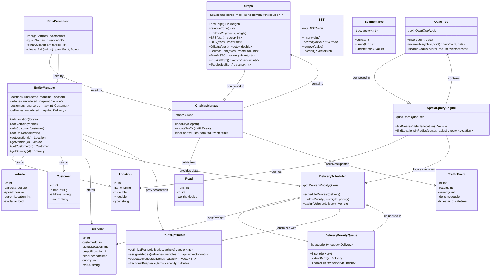

# Smart City UML - Mermaid Diagram

## Class Diagram



## Component Summary

| # | Class | Purpose |
|---|-------|---------|
| 1 | **EntityManager** | Central storage for all entities (Location, Vehicle, Customer, Delivery) |
| 2 | **Graph** | City topology and pathfinding (BFS, DFS, Dijkstra, MST, etc.) |
| 3 | **QuadTree** | Spatial indexing for efficient location queries |
| 4 | **BST** | Binary Search Tree for deadline-based sorting |
| 5 | **SegmentTree** | Range queries for traffic density analysis |
| 6 | **DeliveryPriorityQueue** | Priority queue for delivery scheduling |
| 7 | **DeliveryScheduler** | Manages delivery scheduling and vehicle assignment |
| 8 | **CityMapManager** | Manages city map, graph, and traffic updates |
| 9 | **SpatialQueryEngine** | Spatial queries (nearest vehicle, radius search) |
| 10 | **DataProcessor** | General algorithms (sort, search, closest pair) |
| 11 | **RouteOptimizer** | Route optimization using greedy algorithms |

## Data Flow Architecture

```
INPUT
  ↓
EntityManager (Database Layer)
  ↓
CityMapManager (Map & Routing Layer)
  ↓
DeliveryScheduler (Scheduling Layer)
  ↓
RouteOptimizer (Optimization Layer)
  ↓
SpatialQueryEngine (Query Layer)
  ↓
OUTPUT (Routes, Assignments, Schedules)
```

## Key Features

- **11 Main Classes** covering all system needs
- **Graph algorithms** for pathfinding (Dijkstra, BFS, DFS, MST)
- **Spatial indexing** with QuadTree for efficient searches
- **Priority-based** delivery scheduling
- **Greedy algorithms** for route optimization
- **Sorting algorithms** for data processing (MergeSort, QuickSort)
- **Range queries** for traffic analysis (SegmentTree)
